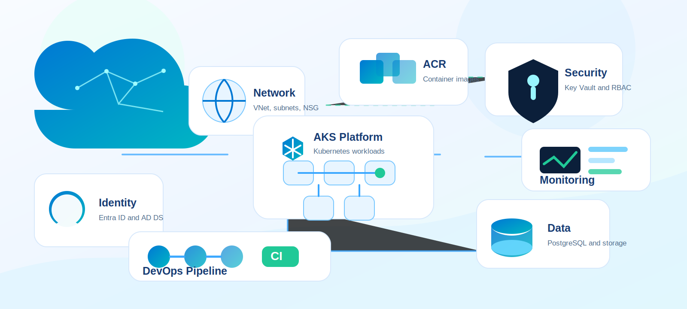
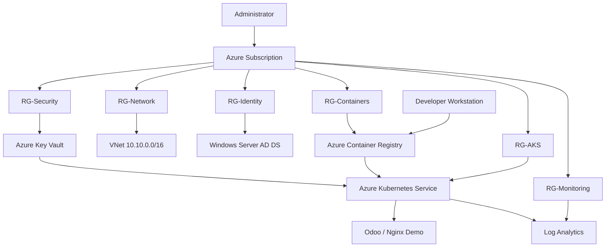

# Architecture

## Objective

Design an enterprise-style Azure platform that can be implemented gradually on a Free or Student subscription.



## High-Level Architecture



## Resource Groups

| Resource Group | Purpose |
|---|---|
| RG-Network | VNet, subnets, NSGs, route tables |
| RG-Identity | Domain controller and identity lab resources |
| RG-Compute | Optional Windows and Linux VMs |
| RG-Security | Key Vault and security resources |
| RG-Containers | Azure Container Registry |
| RG-AKS | Azure Kubernetes Service |
| RG-Monitoring | Log Analytics and alerts |
| RG-DevOps | Self-hosted agents or deployment helpers |

## Network Plan

| Subnet | CIDR | Purpose |
|---|---|---|
| Management | 10.10.1.0/24 | Admin VMs and management tools |
| Servers | 10.10.2.0/24 | Domain controller and servers |
| AKS | 10.10.3.0/24 | AKS nodes |
| Database | 10.10.4.0/24 | Database resources |
| PrivateEndpoint | 10.10.5.0/24 | Private endpoints |
| AzureBastionSubnet | 10.10.255.0/26 | Azure Bastion |

## Naming Convention

```text
rg-network-lab
vnet-core-lab
snet-aks-lab
nsg-aks-lab
vm-dc01-lab
kv-aekp-lab
acr<a unique suffix>
aks-aekp-lab
law-aekp-lab
```

## Cost Principles

- Build one phase at a time.
- Delete or stop compute when finished.
- Avoid running Bastion continuously unless needed.
- Use one small AKS node pool for practice.
- Prefer documentation screenshots over keeping every service live.

