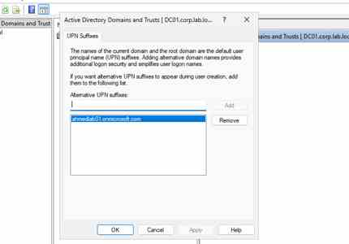

# 03 - Active Directory

## Objective

Deploy a small Windows Server VM and configure Active Directory Domain Services for hybrid identity practice.

## Free Subscription Warning

This phase can generate cost. Use the smallest supported VM for learning and stop/delete it when not needed.

## Lab Values

| Item | Value |
|---|---|
| VM Name | vm-dc01-lab |
| Domain | corp.lab.local |
| Subnet | Servers |
| Role | AD DS, DNS |

## Implementation Flow

1. Create Windows Server VM in `RG-Identity`.
2. Assign static private IP.
3. Install AD DS role.
4. Promote server to domain controller.
5. Create OUs, users, and groups.
6. Configure DNS forwarders.

## PowerShell Commands Inside VM

```powershell
Install-WindowsFeature AD-Domain-Services -IncludeManagementTools

Install-ADDSForest `
  -DomainName "corp.lab.local" `
  -DomainNetbiosName "CORP" `
  -InstallDns
```

## Verification

```powershell
Get-ADDomain
Get-ADUser -Filter *
Get-DnsServerZone
```

## Screenshot Checklist

- VM overview
- Server Manager AD DS role
- Domain created
- Active Directory Users and Computers

## Lab Screenshot

The following screenshot documents the configured UPN suffix used for the hybrid identity lab.


