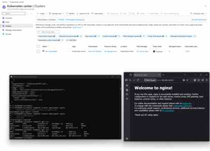

# 08 - Azure Kubernetes Service

## Objective

Create a small AKS cluster connected to the lab VNet and Azure Container Registry.

## Free Subscription Warning

AKS worker nodes cost money. Use the smallest practical node size and delete the cluster after practice if credits are limited.

## Implementation

```powershell
.\scripts\05-create-aks.ps1 `
  -Location "westeurope" `
  -AcrName "acraekplab001"
```

## Get Credentials

```powershell
az aks get-credentials `
  --resource-group RG-AKS `
  --name aks-aekp-lab `
  --overwrite-existing
```

## Verification

```powershell
kubectl get nodes
kubectl get pods -A
```

## Deploy Starter App

```powershell
kubectl apply -f .\kubernetes\nginx
kubectl get svc -n web
```

## Lab Screenshot

The following screenshot validates the AKS cluster, Kubernetes service, and Nginx workload access path.


